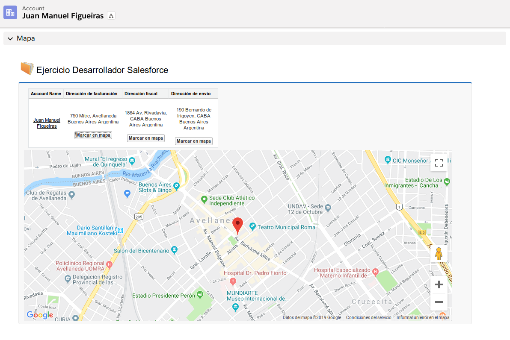
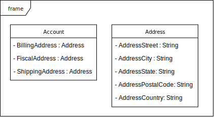

# Google Maps Salesforce

Ejercicio desarrollado en Salesforce para visualizar múltiples direcciones de una misma cuenta con la implementación de Google Maps para geolocalizar y obtener las coordenadas de las ubicaciones.

## Captura

## Diagrama

